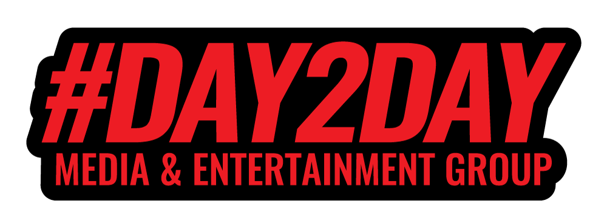
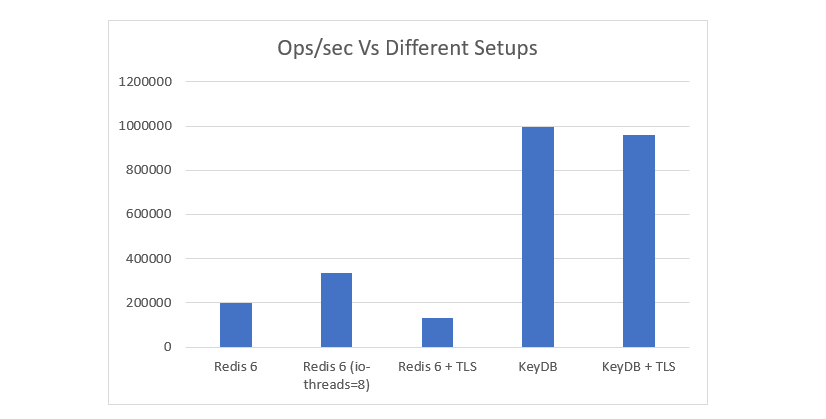

  
&nbsp;

    
  
&nbsp;

# [Day2Day Group Technologies](https://day2dayja.com)

Created by: [**MrDay2Day**](https://github.com/MrDay2Day)  
Node Version: [**v18.19.0**](https://nodejs.org/en/download/package-manager)

## What is **Repo** this?

**Short answer:** A Boilerplate NodeJS Express Server Template written in Typescript built for scale!

**The not so short answer:** This is a _work-in-progress_ **boilerplate** `Typescript` written `Express` `REST` Server with integrated `WebSocket` & ~~`Redis`~~ **->** `KeyDB`. This _template_ is design to operate at scale using ~~`Redis`~~ **->** `KeyDB` and can easily be deployed as a node cluster or/and on separate machines locally or/and globally.

This template has built-in file management using `S3` _(Simple Storage Service)_ protocol and an emailing engine that can send raw `html` emails with **attachments** through `AWS SES` _(Simple Emailing Service)_.

**NB:**_There is also a unique authorization method which I personally use which tags all machines with a unique id stored in a cookie that make a request to server so you are able to have some sense of the devices used by your users and is also very helpful when it comes to security and usage patterns for users._

### **These are all custom solutions and are at no point in time a RULE that must be followed, you are welcome to make changes as you see fit.**

## What did I build **Repo**?

Simple I am a **developer** who creates a lot of _servers_ and I often find myself _copying_ and _pasting_ from previous projects the same code. So I said to myself why not just create a _general template_ that has all the things I use most in my favorite worse language `Javascript` with a bit of seasoning being `Typescript`.

So I've integrated a lot of 3rd party packages and services which I know a lot of people will love and also so honorary mentions from my favorites' list.

### Services

- Backblaze
- AWS SES
- ClickSend

### Databases

- MongoDB
- MySQL
- PostGreSQL
- ~~Redis~~ -> KeyDB (Pub/Sub implementation **ONLY**)

### Technologies

- ExpressJS
- Multer
- Socket.IO
- Cors
- Compression

---

## Why recommend **KeyDB** > Redis🖕🏿

Well, that is because of the whole [license](https://redis.io/legal/licenses/) issue and performance. In multiple test KeDB out performed `Redis` by a significant amount. [**`KeyDB`**](https://docs.keydb.dev/) might not be fully up-to-date with `Redis` 7 however it still has most of the main features of `Redis` to be used as an alternative for cache store, database & Pub/Sub.

You are still able to use `Redis` if it and it's license best suit your needs

---

### **Key Features**

1. Self generating SQL databases and tables.
1. Scalability through ~~Redis~~ **-> KeyDB** using websocket connections.
1. Using multiple database concurrently.

---

## Setup

Copy and paste `.env.template` to `.env`

    cp .env.template .env

Then edit the `.env` file with the necessary credentials.

You are able to use multiple databases in this template whether individually or all at once `PostGres`, `MySQL` and `MongoDB`.

You are able to auto create Database and Tables/Collections on the fly when server starts up.

To start **server** in development mode:

    npm i

Then

    npm run dev

This will start the typescript compiler and also Nodemon

## Feature & Technologies List

These are features & technologies that may or may not be integrated in the future.

**Stages 👇🏿**

👉🏿 ✅ Completed  
👉🏿 ➡️ In Progress  
👉🏿 ✏️ Planning  
👉🏿 💭 Considering  
👉🏿 ⚠️ Issue  
👉🏿 ❌ Cancelled

**Implementation Style 👇🏿**  
👉🏿 💡 Custom Implementation _(All Custom implementations are accompanied by documentation and examples)_  
👉🏿 🕯️ Standard/Traditional Implementation  
👉🏿 ❓ Not Sure

**Current List**

- ✅ MySQL💡
- ✅ PostGrSQL💡 _([Large community of extension](https://gist.github.com/joelonsql/e5aa27f8cc9bd22b8999b7de8aee9d47))_
- ✅ MongoDB💡 _(Recommended DB for Scale)_
- ✅ Socket.IO💡
- ✅ ~~Redis~~ -> KeyDB (Pub/Sub implementation **ONLY**)💡
- ✅ Multer💡
- ✅ Backblaze💡
- ✏️ Dockerize🕯️
- ✏️ Custom Task Queue🕯️
- ✅ AWS💡
- ⚠️ tRCP❓
- 💭 GraphQL❓
- ➡️ ServerSide Events💡
- ✏️ Paddle❓
- ✏️ Stripe❓
- ✏️ Paypal❓
- ✏️ Stripe❓
- 💭 HandlebarsJS _(For specified routes)_
- 💭 Google Auth _(With Recommendations and Procedures)_
- 💭 Facebook Auth _(With Recommendations and Procedures)_
